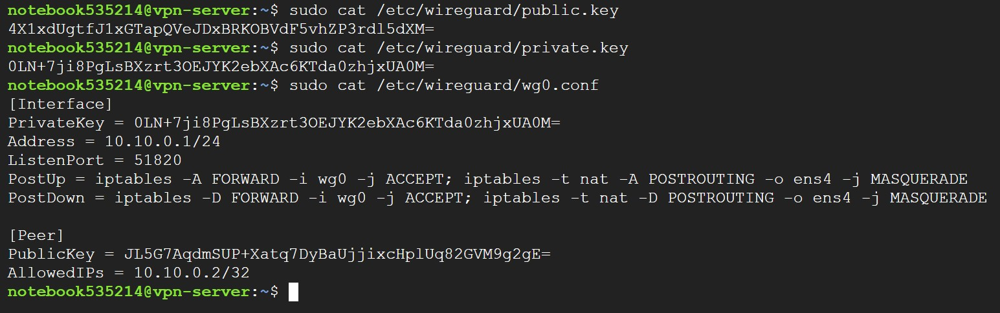

University: [ITMO University](https://itmo.ru/ru/)

Faculty: [FICT](https://fict.itmo.ru)

Course: [Introduction in routing](https://itmo-ict-faculty/network-programming)

Year: 2024/2025

Group: K3321

Author: Naderi Mariam Shakhovna

Lab: Lab1

Date of create: 11.04.2025

Date of finished: 28.04.2025

# Лабораторная работ №1 "Установка CHR и Ansible, настройка VPN"

`Цель работы:`
Целью данной работы является развертывание виртуальной машины на базе платформы Microsoft Azure с установленной системой контроля конфигураций Ansible и установка CHR в VirtualBox

## Ход работы

### VPN-Server

Сначала была развернута виртуальная машина для vpn-server.


На сервер были установлены python и ansible.

```
sudo apt update
sudo apt install python3-pip
sudo pip3 install ansible
```


### VPN-Client

Далее былa развернута вторая виртуальная машина для vpn-client на VirtualBox. На нее был установлен CHR (RouterOS) версия 7.18.2 


Также были проведены настройки адаптера, чтобы был доступ в интернет.


При входе в микротик вводятся логин (admin) и пароль (пустая строка). Далее устанавливается новый пароль.

Проверим, что есть доступ в интернет.


### Создание VPN туннеля

Для организации VPN туннеля был использован Wireguard. 

#### Настройка сервера

Установим Wireguard и сгенерируем приватный и публичный ключи.

```
sudo apt update
sudo apt install wireguard iptables
wg genkey | sudo tee /etc/wireguard/private.key | wg pubkey | sudo tee /etc/wireguard/public.key
```

 Также прописываем конфигурационный файл в `/etc/wireguard/wg0.conf`:



Проверим статус Wireguard и состояние интерфейса:


#### Настройка клиента

Настроим конфигурацию клиента, создадим интерфейс wg0, настроим ключи, порт и адресс.


### Результат:

#### Server -> Client:


