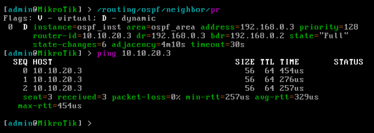

University: [ITMO University](https://itmo.ru/ru/)

Faculty: [FICT](https://fict.itmo.ru)

Course: [Introduction in routing](https://itmo-ict-faculty/network-programming)

Year: 2024/2025

Group: K3321

Author: Naderi Mariam Shakhovna

Lab: Lab2

Date of create: 15.05.2025

Date of finished: 06.06.2025

# Лабораторная работ №2 "Развертывание дополнительного CHR, первый сценарий AnsibleN"

`Цель работы:`
С помощью Ansible настроить несколько сетевых устройств и собрать информацию о них. Правильно собрать файл Inventory.

## Ход работы

### Схема

### Настройка второго VPN-тунеля

Как в первой лабе был настроен второй клиент с помощью wireguard. На картинках видно, что пинг до сервера идет. 

### Настройка с помощью Ansible

Был прописан инвентарь hosts.ini:

После все команды были прописаны в ямле (conf.yml, там нет экспорта это в другом файле):

Проверяем, что есть связь с хостами:

Запускаем:

Проверяем работу ospf, ниже видно, что хосты видят соседа и проходит пинг:

С помощью еще одного ямла был сделан экспорт (данные экспорта есть в папке лабы):

Ошибок нет:

