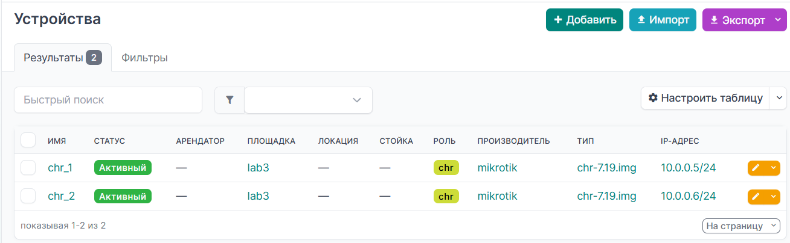
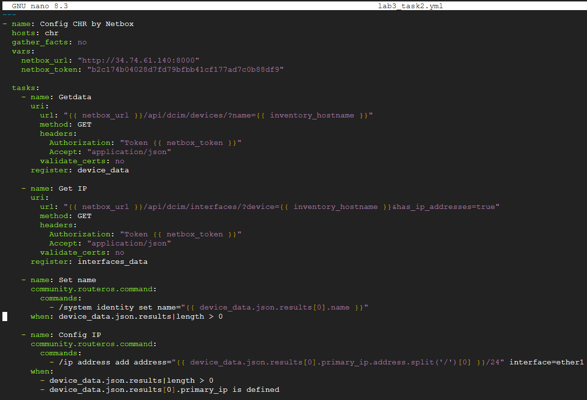

University: [ITMO University](https://itmo.ru/ru/)

Faculty: [FICT](https://fict.itmo.ru)

Course: [Introduction in routing](https://itmo-ict-faculty/network-programming)

Year: 2024/2025

Group: K3321

Author: Naderi Mariam Shakhovna

Lab: Lab3

Date of create: 08.06.2025

Date of finished: 18.06.2025

# Лабораторная работ №3 "Развертывание Netbox, сеть связи как источник правды в системе технического учета Netbox"

`Цель работы:`
С помощью Ansible и Netbox собрать всю возможную информацию об устройствах и сохранить их в отдельном файле.

## Ход работы

### Схема

### 1. Поднять Netbox на дополнительной VM.

В Google Cloud был создан второй сервер - netbox. На нем был поднят netbox:

По адресу виртуальной машины открывается сайт:

### 2. Заполнить всю возможную информацию о ваших CHR в Netbox.

Была заполнена информация о клиентах:

### 3. Используя Ansible и роли для Netbox в тестовом режиме сохранить все данные из Netbox в отдельный файл, результат приложить в отчёт.

Далее был прописан скрипт для получения данных из netbox в файл (результат в файле [netbox_export.json](https://github.com/MariamNaderi/2024_2025-network_programming-k3321-naderi_m_s/blob/main/lab3/netbox_export.json)):

### 4. Написать сценарий, при котором на основе данных из Netbox можно настроить 2 CHR, изменить имя устройства, добавить IP адрес на устройство.

Был написан сценарий для настройки клиентов:

Можно увидеть, что у интерфейсов клиентов добавился адрес:

### 5. Написать сценарий, позволяющий собрать серийный номер устройства и вносящий серийный номер в Netbox.

Был написан сценарий для добавления данных в netbox (серийник и имя):

Можно увидеть, что появлись серийные номера в netbox:

