University: [ITMO University](https://itmo.ru/ru/)

Faculty: [FICT](https://fict.itmo.ru)

Course: [Introduction in routing](https://itmo-ict-faculty/network-programming)

Year: 2024/2025

Group: K3321

Author: Naderi Mariam Shakhovna

Lab: Lab4

Date of create: 15.06.2025

Date of finished: 18.06.2025

# Лабораторная работ №4 "Базовая 'коммутация' и туннелирование используя язык программирования P4"

`Цель работы:`
Изучить синтаксис языка программирования P4 и выполнить 2 задания обучающих задания от Open network foundation для ознакомления на практике с P4.

## Ход работы

### 1. Развернуть Vagrant

В начале были установлены VB и vagrant. После был склонирован репозиторий p4lang/tutorials. 

Как итог, развернутый vagrant.

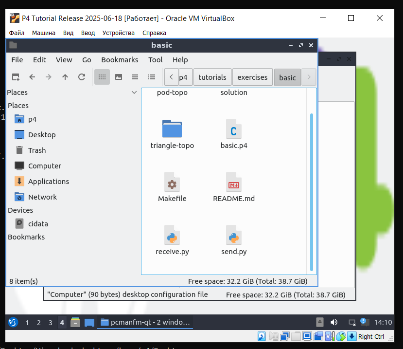

### 2. Implementing Basic Forwarding 

Схема:

По заданию был исправлен файл [basic.p4](https://github.com/MariamNaderi/2024_2025-network_programming-k3321-naderi_m_s/blob/main/lab4/basic.p4).

В файле было реализовано извлечение заголовков Ethernet и IPv4:

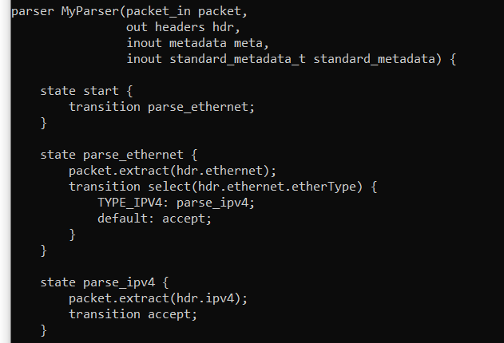

Также было реализовано действие ipv4_forward (установка egress_spec, обновление MAC-адресов (src/dst), уменьшение TTL):

Еще были добавлены IPv4- и Ethernet-заголовоки в пакет.

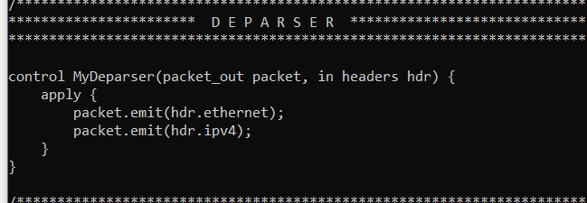

Проверяем работу:

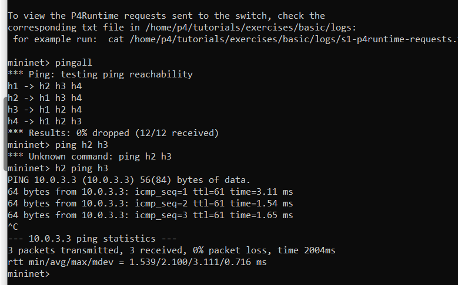

### 3. Implementing Basic Tunneling  

Схема:

По заданию был исправлен файл [basic_tunnel.p4](https://github.com/MariamNaderi/2024_2025-network_programming-k3321-naderi_m_s/blob/main/lab4/basic_tunnel.p4).

Было добавлено новое состояние parse_myTunnel для обработrb пакетов из тунеля, теперь парсится и MyTunnel.

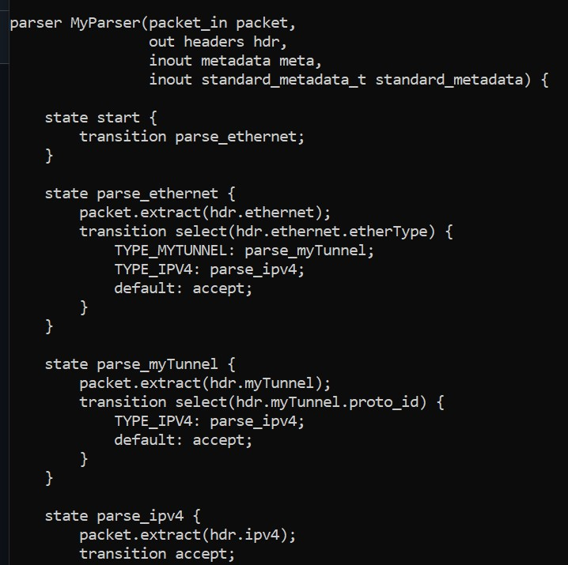

Далее было добавлено новое действие myTunnel_forward и новая таблица myTunnel_exact. Плюс обновление логики в apply.

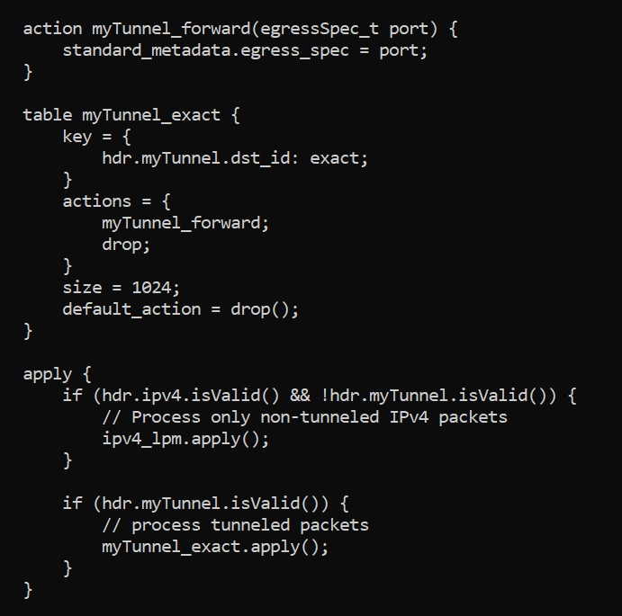

И в конце депарсинг, теперь добавляется заголовок тунеля.

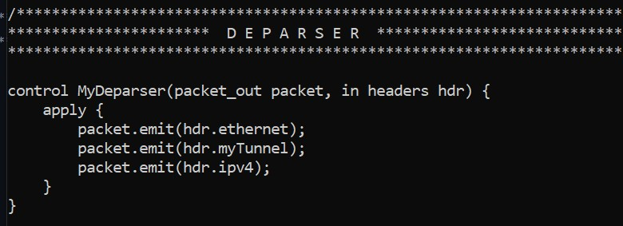

Можно увидеть, что после запускаются h1 и h2.

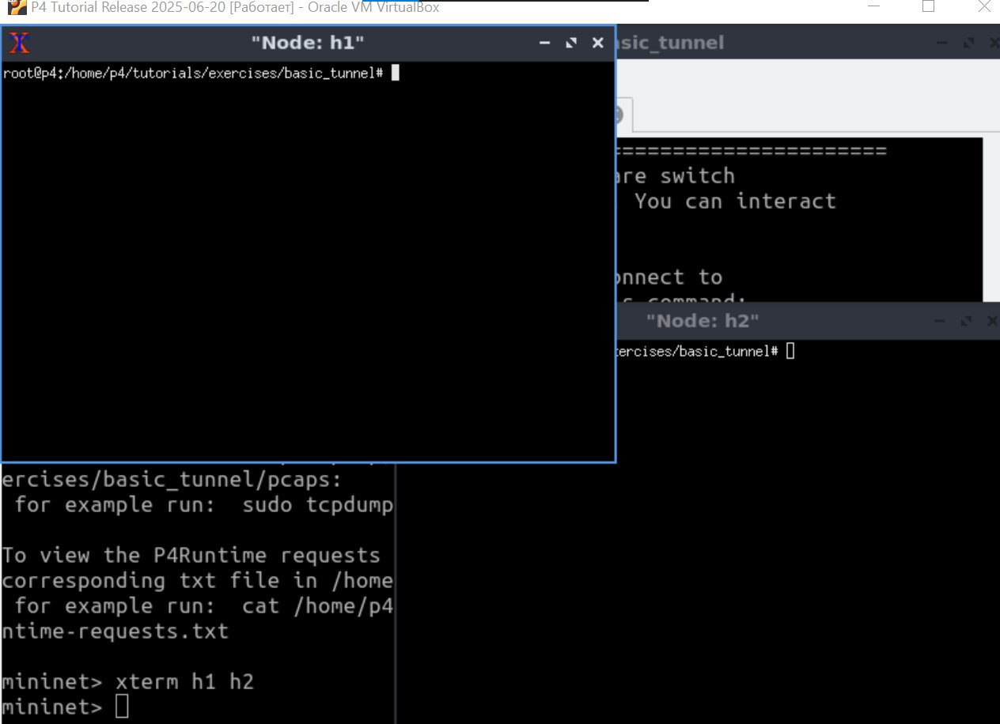

Далее был запущен сервер на хосте 2, а с первого было отправлено сообщение без тунеля, все прошло успешно:

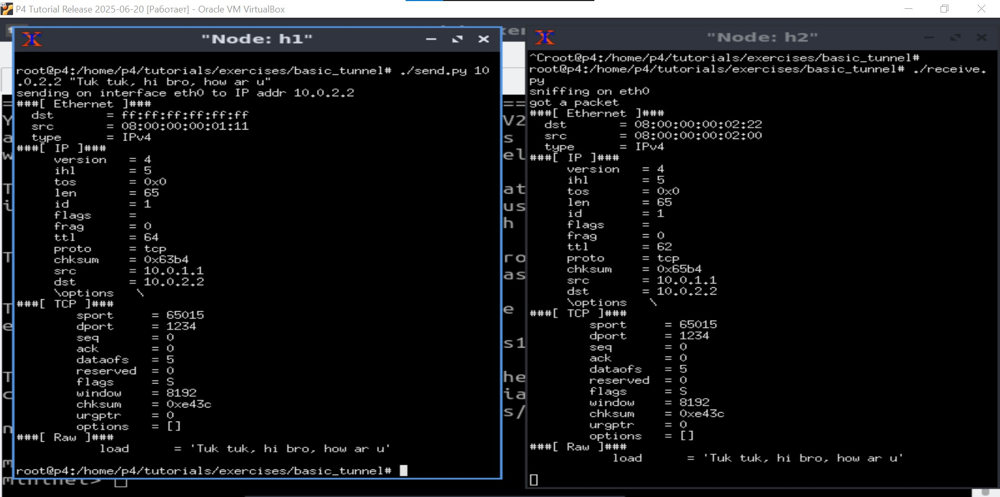

Тут видно, что 3 хост тоже работает.

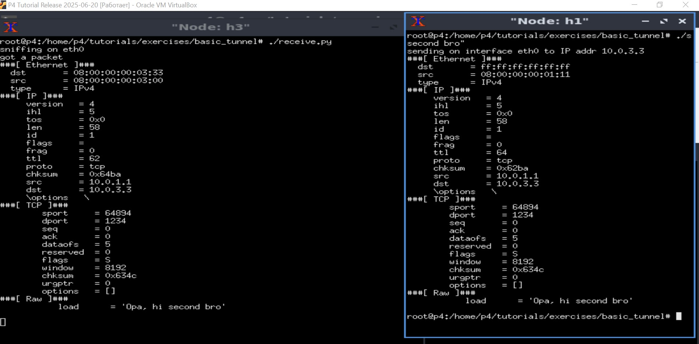

Теперь тест с тунелем, видно, что появилась шапка тунеля.

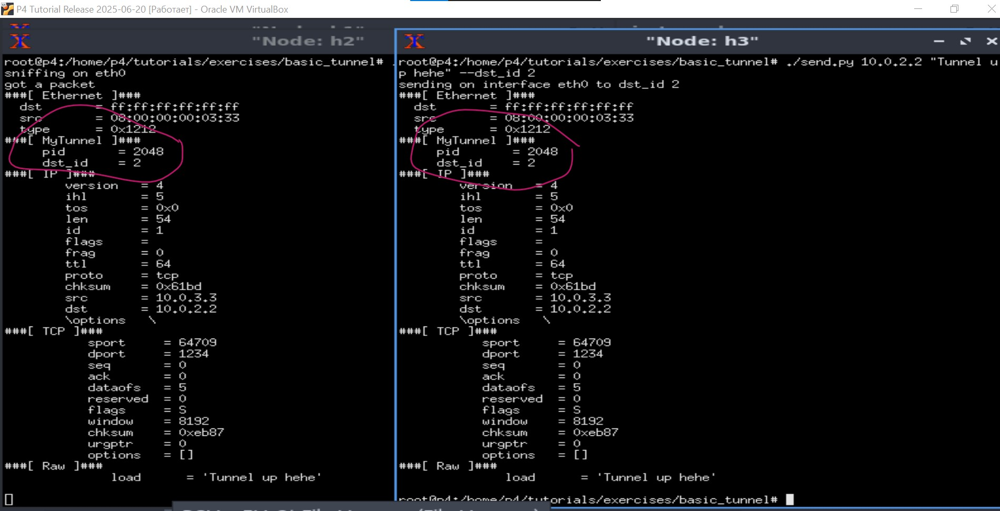

