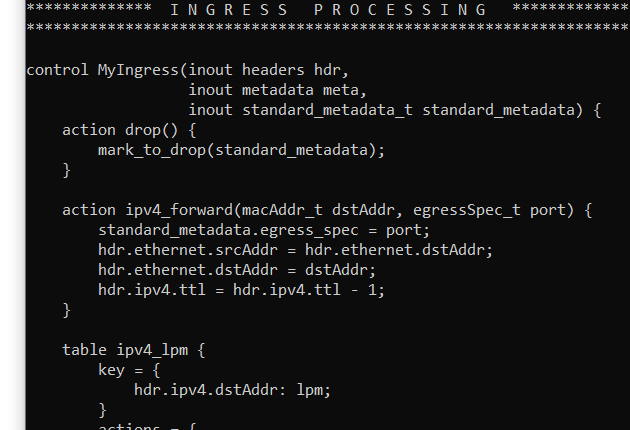

University: [ITMO University](https://itmo.ru/ru/)

Faculty: [FICT](https://fict.itmo.ru)

Course: [Introduction in routing](https://itmo-ict-faculty/network-programming)

Year: 2024/2025

Group: K3321

Author: Naderi Mariam Shakhovna

Lab: Lab4

Date of create: 15.06.2025

Date of finished: 18.06.2025

# Лабораторная работ №4 "Базовая 'коммутация' и туннелирование используя язык программирования P4"

`Цель работы:`
Изучить синтаксис языка программирования P4 и выполнить 2 задания обучающих задания от Open network foundation для ознакомления на практике с P4.

## Ход работы

### Схема

### 1. Развернуть Vagrant

В начале были установлены VB и vagrant. После был склонирован репозиторий p4lang/tutorials. 

Как итог, развернутый vagrant.

### 2. Развернуть Vagrant

[basic.p4](https://github.com/MariamNaderi/2024_2025-network_programming-k3321-naderi_m_s/blob/main/lab4/basic.p4)

